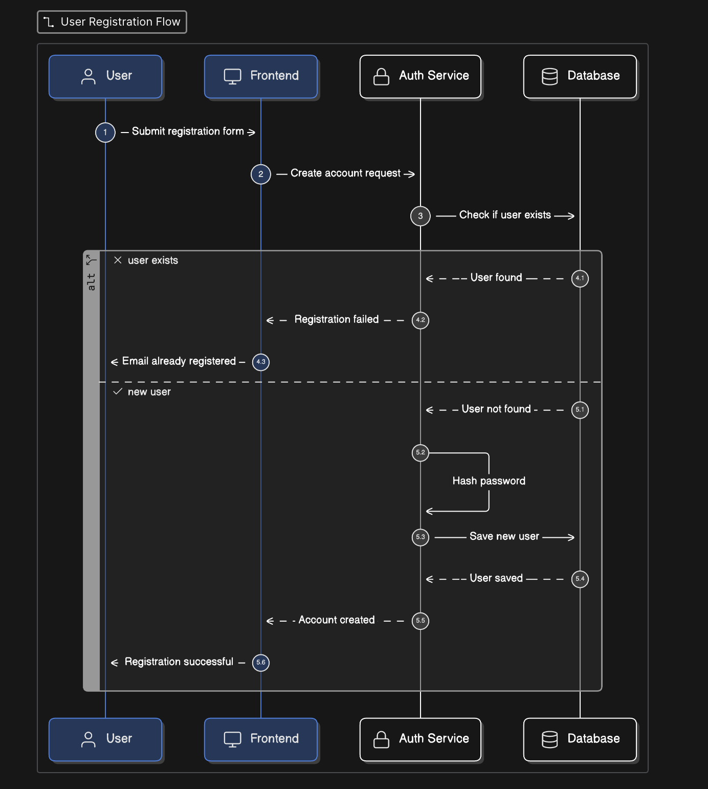
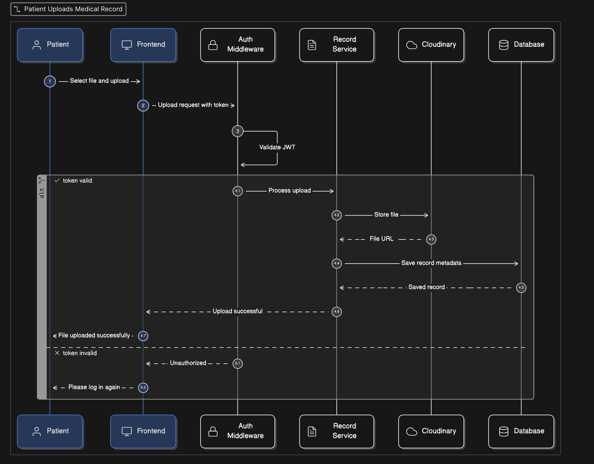
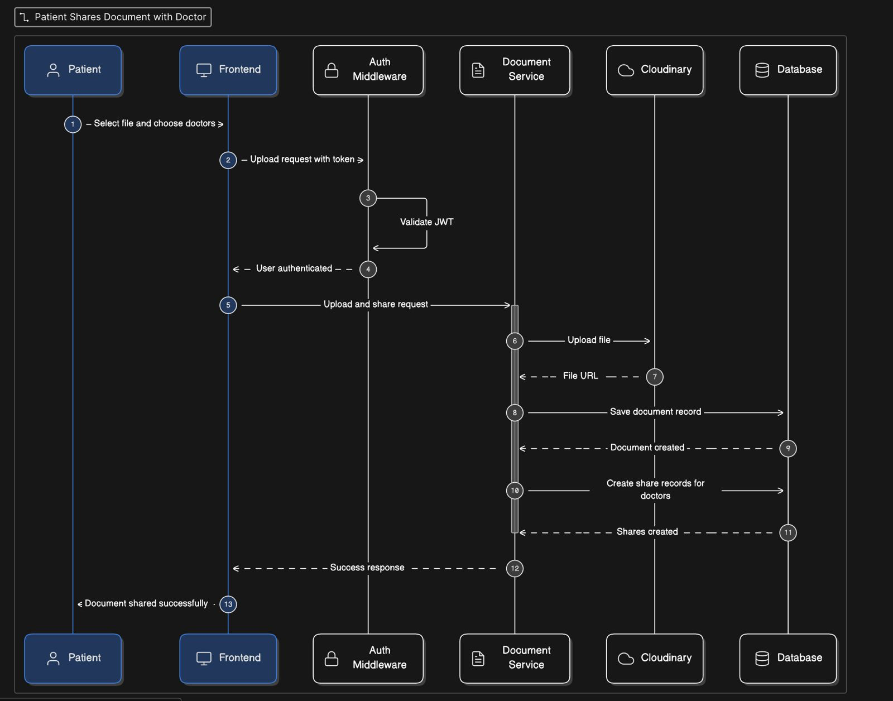
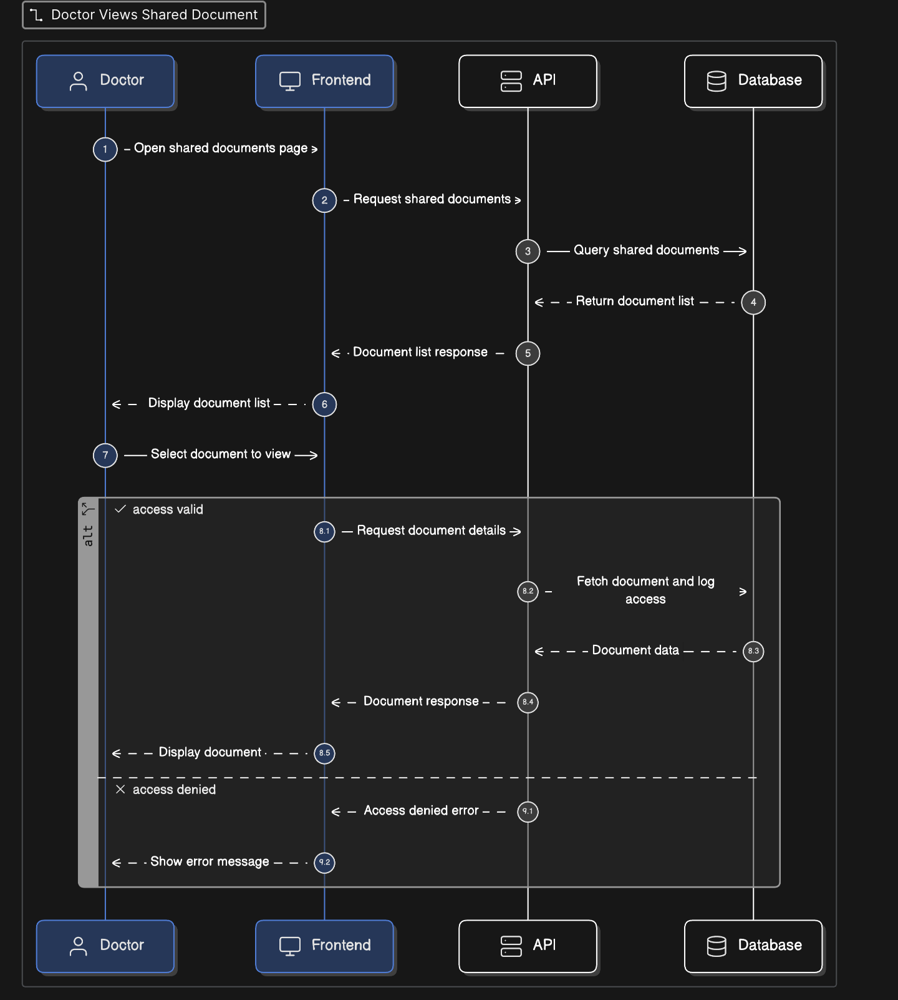

# Sequential Diagrams — SD-Capstone

This document describes all sequence diagrams for the SD-Capstone healthcare system. Each diagram captures the interaction flow between system actors and services for a specific use case.

---

## 1. User Registration Flow



**Actors / Participants:**
- **User** — End user submitting the registration form
- **Frontend** — Client-side application
- **Auth Service** — Handles authentication and account creation logic
- **Database** — Persistent data store

### Flow

```
User → Frontend → Auth Service → Database
```

| Step | From | To | Message | Type |
|------|------|----|---------|------|
| 1 | User | Frontend | Submit registration form | Sync |
| 2 | Frontend | Auth Service | Create account request | Sync |
| 3 | Auth Service | Database | Check if user exists | Sync |

### Alt Block — `user exists` ✗

| Step | From | To | Message | Type |
|------|------|----|---------|------|
| 4.1 | Database | Auth Service | User found | Return (dashed) |
| 4.2 | Auth Service | Frontend | Registration failed | Return (dashed) |
| 4.3 | Frontend | User | Email already registered | Return (dashed) |

### Alt Block — `new user` ✓

| Step | From | To | Message | Type |
|------|------|----|---------|------|
| 5.1 | Database | Auth Service | User not found | Return (dashed) |
| 5.2 | Auth Service | Auth Service | Hash password | Self-loop |
| 5.3 | Auth Service | Database | Save new user | Sync |
| 5.4 | Database | Auth Service | User saved | Return (dashed) |
| 5.5 | Auth Service | Frontend | Account created | Return (dashed) |
| 5.6 | Frontend | User | Registration successful | Return (dashed) |

---

## 2. Patient Uploads Medical Record



**Actors / Participants:**
- **Patient** — Authenticated user uploading a file
- **Frontend** — Client-side application
- **Auth Middleware** — Validates JWT tokens
- **Record Service** — Handles file processing and metadata
- **Cloudinary** — Cloud storage for medical files
- **Database** — Persistent data store

### Flow

```
Patient → Frontend → Auth Middleware → Record Service → Cloudinary / Database
```

| Step | From | To | Message | Type |
|------|------|----|---------|------|
| 1 | Patient | Frontend | Select file and upload | Sync |
| 2 | Frontend | Auth Middleware | Upload request with token | Sync |
| 3 | Auth Middleware | Auth Middleware | Validate JWT | Self-loop |

### Alt Block — `token valid` ✓

| Step | From | To | Message | Type |
|------|------|----|---------|------|
| 4.1 | Auth Middleware | Record Service | Process upload | Sync |
| 4.2 | Record Service | Cloudinary | Store file | Sync |
| 4.3 | Cloudinary | Record Service | File URL | Return (dashed) |
| 4.4 | Record Service | Database | Save record metadata | Sync |
| 4.5 | Database | Record Service | Saved record | Return (dashed) |
| 4.6 | Record Service | Frontend | Upload successful | Return (dashed) |
| 4.7 | Frontend | Patient | File uploaded successfully | Return (dashed) |

### Alt Block — `token invalid` ✗

| Step | From | To | Message | Type |
|------|------|----|---------|------|
| 5.1 | Auth Middleware | Frontend | Unauthorized | Return (dashed) |
| 5.2 | Frontend | Patient | Please log in again | Return (dashed) |

---

## 3. Patient Shares Document with Doctor



**Actors / Participants:**
- **Patient** — Authenticated user sharing a file
- **Frontend** — Client-side application
- **Auth Middleware** — Validates JWT tokens
- **Document Service** — Manages document upload and share record creation
- **Cloudinary** — Cloud storage for documents
- **Database** — Persistent data store

### Flow

```
Patient → Frontend → Auth Middleware → Document Service → Cloudinary / Database
```

| Step | From | To | Message | Type |
|------|------|----|---------|------|
| 1 | Patient | Frontend | Select file and choose doctors | Sync |
| 2 | Frontend | Auth Middleware | Upload request with token | Sync |
| 3 | Auth Middleware | Auth Middleware | Validate JWT | Self-loop |
| 4 | Auth Middleware | Frontend | User authenticated | Return (dashed) |
| 5 | Frontend | Document Service | Upload and share request | Sync |
| 6 | Document Service | Cloudinary | Upload file | Sync |
| 7 | Cloudinary | Document Service | File URL | Return (dashed) |
| 8 | Document Service | Database | Save document record | Sync |
| 9 | Database | Document Service | Document created | Return (dashed) |
| 10 | Document Service | Database | Create share records for doctors | Sync |
| 11 | Database | Document Service | Shares created | Return (dashed) |
| 12 | Document Service | Frontend | Success response | Return (dashed) |
| 13 | Frontend | Patient | Document shared successfully | Return (dashed) |

> **Note:** Steps 5–12 occur within a single activation bar on the Document Service, indicating it orchestrates the entire upload-and-share operation atomically.

---

## 4. Doctor Views Shared Document



**Actors / Participants:**
- **Doctor** — Authenticated user viewing a shared document
- **Frontend** — Client-side application
- **API** — Backend API layer
- **Database** — Persistent data store

### Flow

```
Doctor → Frontend → API → Database
```

| Step | From | To | Message | Type |
|------|------|----|---------|------|
| 1 | Doctor | Frontend | Open shared documents page | Sync |
| 2 | Frontend | API | Request shared documents | Sync |
| 3 | API | Database | Query shared documents | Sync |
| 4 | Database | API | Return document list | Return (dashed) |
| 5 | API | Frontend | Document list response | Return (dashed) |
| 6 | Frontend | Doctor | Display document list | Return (dashed) |
| 7 | Doctor | Frontend | Select document to view | Sync |

### Alt Block — `access valid` ✓

| Step | From | To | Message | Type |
|------|------|----|---------|------|
| 8.1 | Frontend | API | Request document details | Sync |
| 8.2 | API | Database | Fetch document and log access | Sync |
| 8.3 | Database | API | Document data | Return (dashed) |
| 8.4 | API | Frontend | Document response | Return (dashed) |
| 8.5 | Frontend | Doctor | Display document | Return (dashed) |

### Alt Block — `access denied` ✗

| Step | From | To | Message | Type |
|------|------|----|---------|------|
| 9.1 | API | Frontend | Access denied error | Return (dashed) |
| 9.2 | Frontend | Doctor | Show error message | Return (dashed) |

---

## Summary

| # | Diagram | Key Actors | Auth Mechanism |
|---|---------|-----------|----------------|
| 1 | User Registration Flow | User, Frontend, Auth Service, Database | Email uniqueness check |
| 2 | Patient Uploads Medical Record | Patient, Frontend, Auth Middleware, Record Service, Cloudinary, Database | JWT validation |
| 3 | Patient Shares Document with Doctor | Patient, Frontend, Auth Middleware, Document Service, Cloudinary, Database | JWT validation |
| 4 | Doctor Views Shared Document | Doctor, Frontend, API, Database | Access-level check per document |